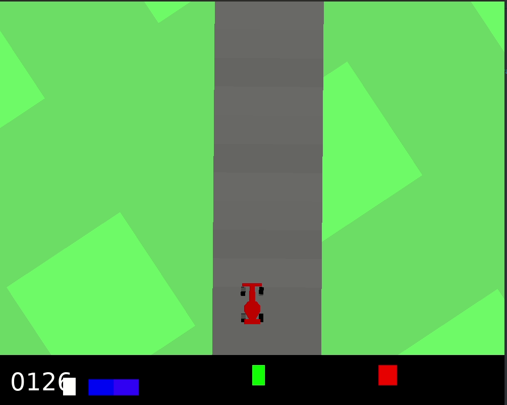

# Self-Driving Racecar with Proximal Policy Optimization

Using [proximal policy optimization](https://openai.com/blog/openai-baselines-ppo/) to train a racecar in the CarRacing-v0 environment of OpenAI Gym.

Check out my project [report](extra/report.pdf) for more details.

## Demo

View the [demo](https://www.youtube.com/watch?v=SyGluS2sT00) of the project in action.

